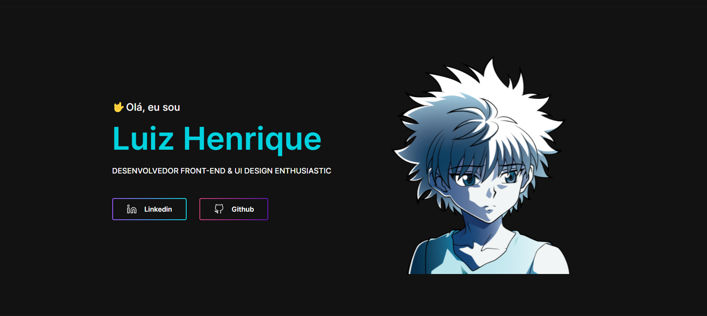

<h1 align="center">
  
</h1>

<h1 align="center">Meu portfólio</h1>

<p align="left">Meu portfólio na versão II. Foi uma iniciativa lá na comunidade do Iuri Code e que acabou virando meu portfólio principal.</p>

<br/>

## Pré requisitoos

Antes de começar, você vai precisar ter instalado em sua máquina as seguintes ferramentas:
[Git](https://git-scm.com), [Node.js](https://nodejs.org/en/).
Além disto é bom ter um editor para trabalhar com o código como [VSCode](https://code.visualstudio.com/)

<br/>

### 🎲 Rodando o aplicação

```bash
# Clone este repositório
$ git clone https://github.com/lhenriquedev/portfolio-v2.git

# Acesse a pasta do projeto no terminal/cmd
$ cd portfolio-v2

# Instale as dependências
$ yarn ou npm install

# Execute a aplicação em modo de desenvolvimento
$ yarn start ou npm start

# O servidor inciará na porta:3000 - acesse <http://localhost:3000>
```

### 🛠 Tecnologias

As seguintes ferramentas foram usadas na construção do projeto:

- [React](https://pt-br.reactjs.org/)
- [TypeScript](https://www.typescriptlang.org/)
- [React Tab](https://github.com/reactjs/react-tabs)

<br/>
<br/>

### Autor

---

<br/>

<a href="https://twitter.com/lhenrique_dev">
 
 <br />
 <sub><b>Luiz Henrique</b></sub></a> <a href="https://twitter.com/lhenrique_dev" title="Twitter">🚀</a>

Feito com ❤️ por Luiz Henrique 👋🏽 Entre em contato!
